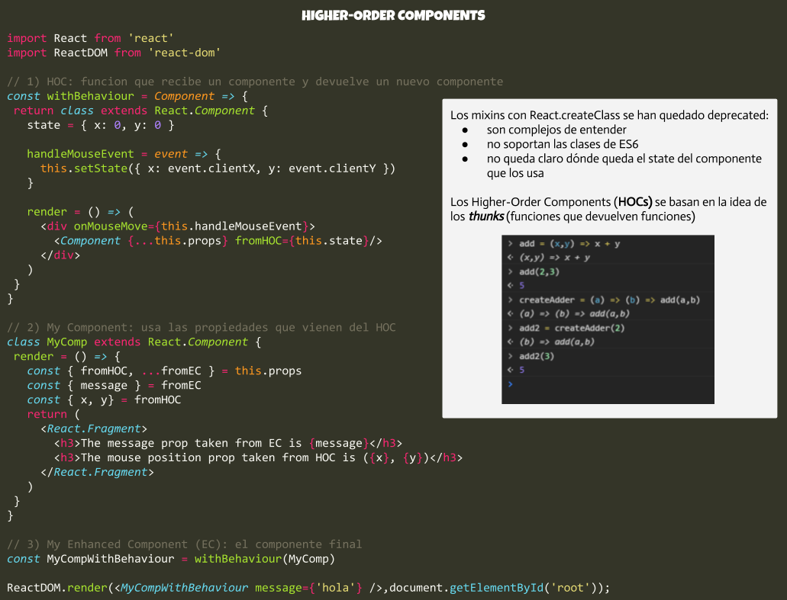

Después de descubrir y ver esta gran charla de [Michael Jackson](https://github.com/mjackson) sobre los Higher-Order Components de React, os comparto más abajo el código de prueba que he realizado y un breve resumen de lo que más me ha ayudado. Este tipo de conferencias sí que merecen la pena. Bien explicado, al grano y sin olor a postureo.

Vamos!

## Referencias

* [Never Write Another HoC](https://youtu.be/BcVAq3YFiuc)
* [Use a render prop!](https://cdb.reacttraining.com/use-a-render-prop-50de598f11ce)