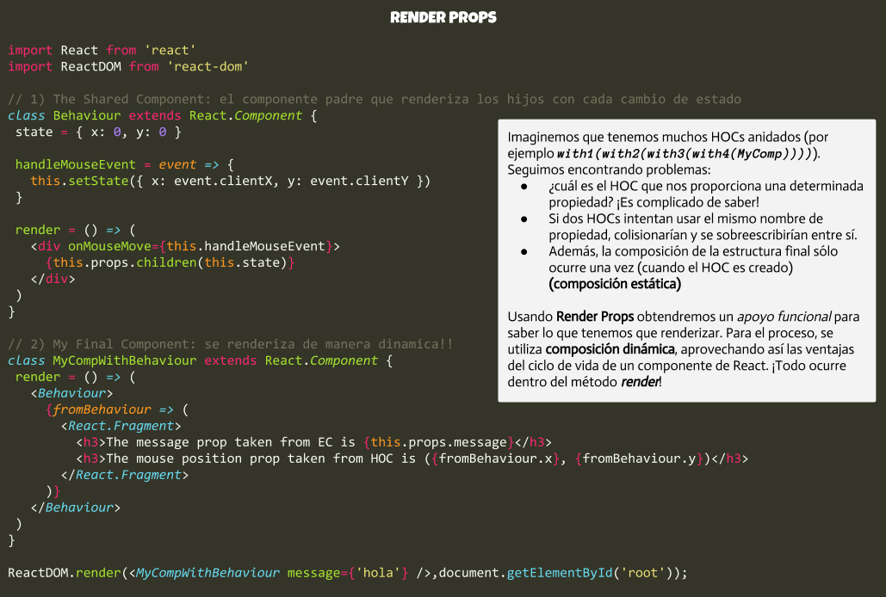

Ayer hablábamos de las ventajas de utilizar *HOCs* frente a los mixins. Y hoy, como os dije, vamos a mostrar las ventajas de utilizar ***Render Props*** con respecto a los *HOCs*. Todo esto queda reflejado en el [vídeo](https://youtu.be/BcVAq3YFiuc) que aquí os compartí. Y está perfectamente explicado. Pero si lo que quieres es tenerlo de una manera rápida y cómoda, como siempre, aquí os dejo la imagen que muestra todo en un simple vistazo. Al menos, como a mí me sirve. La funcionalidad es exactamente la misma que mostramos en el [artículo de ayer](http://reactjspain.com/higher-order-components/). Pero esta vez, de una manera muuuuuuuuuuuuuuuuuuuuuuuucho más ventajosa!

Y ahora, vas a seguir usando ***Higher-Order Components*** para reutilizar código?

## Referencias

* [Never Write Another HoC](https://youtu.be/BcVAq3YFiuc)
* [Use a render prop!](https://cdb.reacttraining.com/use-a-render-prop-50de598f11ce)