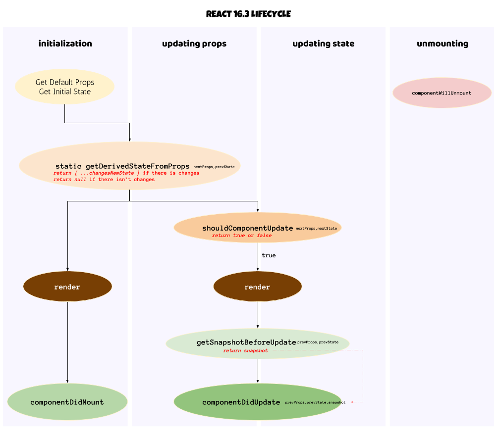

Con el nacimiento de React 16.3, se han incorporado nuevos métodos al ciclo de vida de un componente y se han dejado atrás aquellos que nunca quedaron claro del todo. Hablo de ***componentWillMount***, ***componentWillUpdate*** y ***componentWillReceiveProps***. En mis aplicaciones yo no los utilizaba mucho, así que me ha costado muy poco migrar a la nueva versión.

Los nuevos métodos incorporan una nueva metodología a la hora de entender cómo se comporta un componente cuando se monta o se updatan sus propiedades. La nueva función estática ***getDerivedStateFromProps*** controlará los cambios de estado a través de las propiedades del componente. Sin duda, para mí, es una manera más fácil e intuitiva de manejar dichos cambios. Esta función devolverá en un objeto las modificaciones realizadas en el *state* del componente o *null* si no se desea ejecutar ningún cambio. Esta función nos abre una nueva perspectiva, ya que dejaremos de manejar *this.props* para acceder a las antiguas propiedades e iremos guardando sus cambios a través del propio *state*. Nunca usaremos aquí ***setState***.

Por ejemplo, donde antes poníamos:

  ```javascript
  class RJSComponent extends Component {
    state = {}

    componentWillReceiveProps = nextProps => {
      if (nextProps.message !== this.props.message) {
        ...
      }
    }
  ```

Ahora pondremos:

  ```javascript
  class RJSComponent extends Component {
    state = {
      message = this.props.message
    }

    componentWillReceiveProps = (nextProps, prevState) => {
      if (prevState.message !== nextProps.message) {
        ...
        return {
          ...
          message: nextProps.message
        }
      }
      return null //sin cambio de estado
    }
  ```

También se ha añadido el método ***getSnapshotBeforeUpdate***, ejecutado nada más updatarse el DOM con los nuevos cambios. Esta función nos permite enviar al método ***componentDidUpdate*** un snapshot del componente antes de que se produzcan los cambios de manera definitiva.

Como una imagen vale más que mil palabras, espero que la siguiente os ayude a comprender mejor los estados por los que pasa un componente de React.



Espero que todo esto os haya podido ayudar algo.

## Referencias

* [React v16.3](https://reactjs.org/blog/2018/03/29/react-v-16-3.html)
* [React Component](https://reactjs.org/docs/react-component.html)