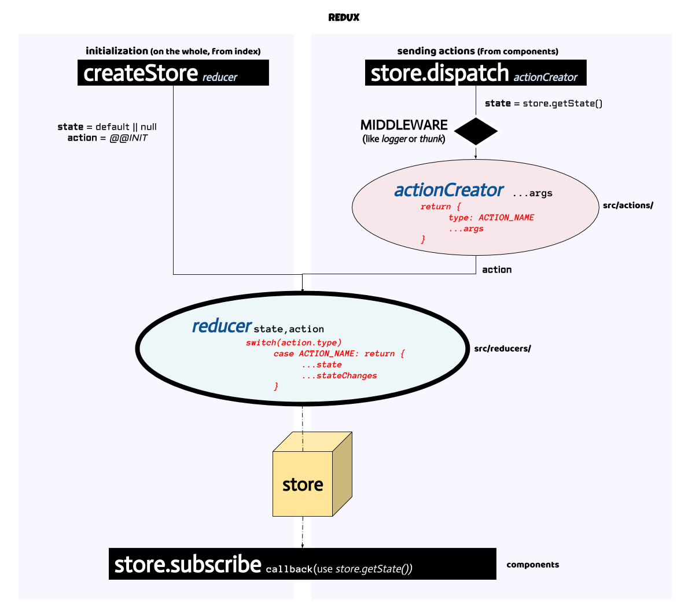

Al empezar a aprender cualquier tecnología, suelo coger papel y boli y hacerme mis dibujos para que mi cabeza logre pillar de la mejor manera posible todo lo que estoy estudiando. Después, lo aplico en proyectos de prueba y cuando lo tengo más o menos asimilado, recopilo todo lo aprendido y me hago mi gráfico de siempre para tenerlo todo bien junto en un sólo vistazo. Con *Redux* no iba a ser diferente y aquí os comparto el esquema sobre cómo se comportan las *acciones* que se realizan sobre el *store* de Redux. Espero que os pueda apañar algo.



Resumiendo, cuando una acción es enviada, ya sea en la propia creación del store con ***createStore*** o desde nuestro componente de React (o de cualquier otra librería o framework, claro está) con ***dispatch***, el proceso lineal ejecutado es algo así como:

  ```swift
    DISPATCH ->
    ACTION (EL 'QUÉ') ->
    REDUCER (EL 'CÓMO') ->
    STORE (LA ÚNICA FUENTE DE VERDAD) ->
    SUBSCRIBE
  ```

Con ***dispatch*** enviamos la acción. El primer parámetro será un objeto con una key *type* indicando el nombre de la acción. Siempre podremos añadir más claves al objeto para el envío de información adicional. Exite la posibilidad de que este parámetro, en vez de un objeto, sea una función, algo que a la larga nos ayudará a la hora de dejar limpio nuestro código y modularizar más nuestra aplicación. Esto se puede hacer gracias a ***redux-thunk***, una librería para añadir *thunk* como middleware. Cuando añadimos un ***middleware*** a nuestra estructura de redux, estaremos añadiendo un paso intermedio entre el *dispatch* y la propia ejecución de la acción que queramos correr.

  ```javascript
  /**
   * src/actions/app 
   */
  export const SET_AUTH_USER = 'SET_AUTH_USER'

  export const setAuthUser = authUser => ({
    type: SET_AUTH_USER,
    authUser,
    token: '1234'
  })
  ```

El ***reducer*** será el encargado final de modificar el árbol de estado (el ***store***) de nuestra aplicación. Es importante recordar aquí que nunca hay que modificar el *state*, sino devolver una copia del mismo añadiendo los nuevos cambios. En el caso de no haber cambios, retornaremos el actual *state*. Un ejemplo rápido y sencillo:

  ```javascript
  /**
   * src/reducers/app 
   */
  import { SET_AUTH_USER } from '/src/actions/app'

  const initialAppState = {
    session: {
      user: null,
      token: null,
      isSetting: true
    }
  }

  const app = (state = initialAppState, action) => {

    switch (action.type) {
      case SET_AUTH_USER: {
        return {
          ...state,
          session: {
            ...state.session,
            user: action.authUser,
            token: action.token,
            isSetting: false
          }
        }
      }
      default:
        return state
    }
  }
  ```

Con estos ejemplos, la ejecución de la acción comenzaría con algo como:

  ```javascript
    store.dispatch(setAuthUser(authUser))
  ```

Con ***subscribe*** agregamos una función como primer argumento que escucha los cambios realizados en el store. Lo más seguro es que quieras llamar al método ***getState()*** para leer el árbol de estado.

¡Esto ha sido todo por hoy!

## Referencias

* [redux.org](http://es.redux.js.org/docs/api/Store.html)