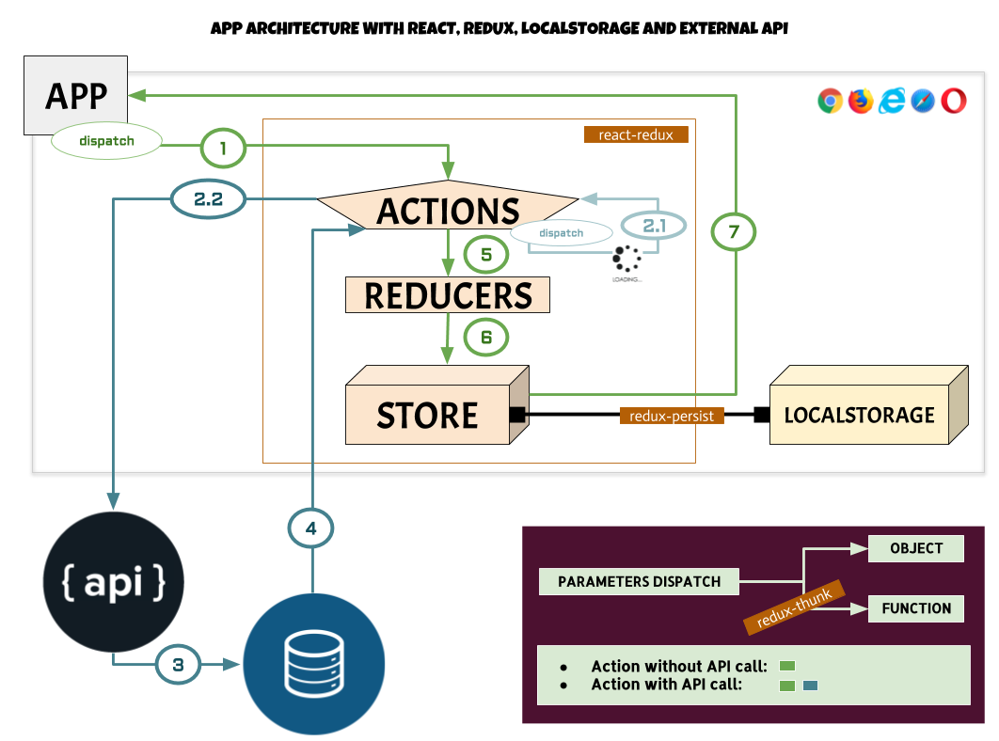

Hoy os dejo un pequeño esquema de lo que sería una aplicación escrita en React con Redux, el LocalStorage del navegador y una API externa. Se incluyen las dependencias principales que afectan a dicha estructura y el ciclo en el proceso de hacer una petición a la API (empezando por el punto 1). Antes de realizarla, eso sí, se puede indicar al *store* de Redux que la petición está en marcha (por ejemplo con *isLoading: true* - punto 2.1, siguiendo con el 5). En este último caso, la interactuación entre la app y redux es más es más rápida. La petición en sí sigue el camino que comienza por el punto 2.2.



Para tener sincronizado en todo momento nuestro *store* de Redux con el *localstorage* de nuestro navegador se usa la librería ***redux-persist***. La librería ***redux-offline*** incluye esta última, además de añadir la gestión del estado de la red ejecutada por la aplicación.

Para poder utilizar funciones en los *dispatch* en vez de sólo objetosutilizamos la librería ***redux-thunk***. Un ejemplo de uso rápido sería:

  ```javascript
  const fetchCars = brandId => dispatch => {
    dispatch({ type: 'RECEIVING', brandId })
    return API('/cars').fetch(brandId)
      .then(
        cars => { dispatch({ type: 'RECEIVED', brandId, cars }) },
        error => { dispatch({ type: 'ERROR', brandId }) }
      )
  }

  dispatch(fetchCars('fiat')) //gracias a redux-thunk!!
  ```

Aquí queremos hacer una petición a la API para que nos devuelva los coches de una determinada marca. En este caso, la acción conlleva varios procesos, ya que primeramente vamos a actualizar el ***store*** de Redux indicando que la petición está en curso y, una vez recibidos todos los coches, volver a actualizar el estado con los coches recibidos y el estado de la petición como finalizada. Todo estos procesos se engloban en uno sola función (*fetchCars*). Gracias a ***redux-thunk*** podremos enviarla con ***dispatch***

No es muy complicado, ¿verdad?